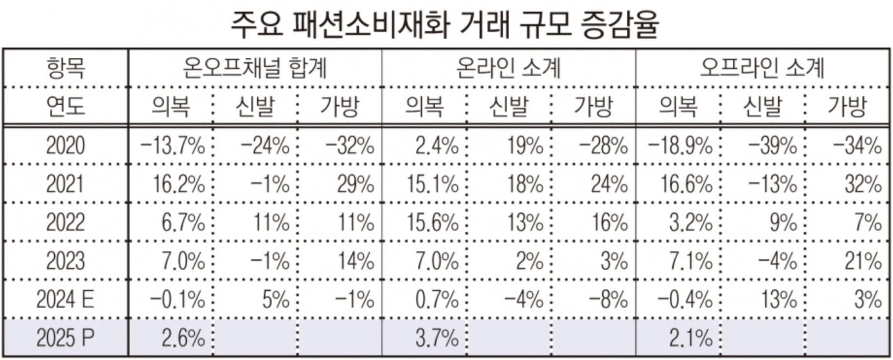
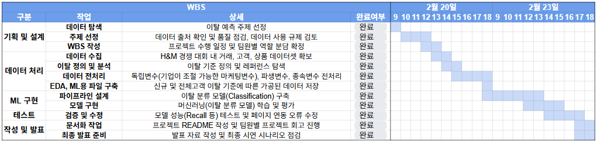
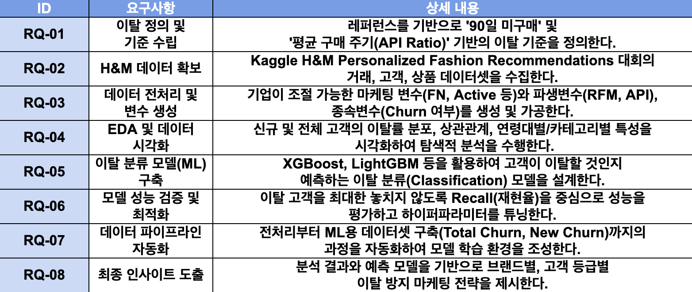
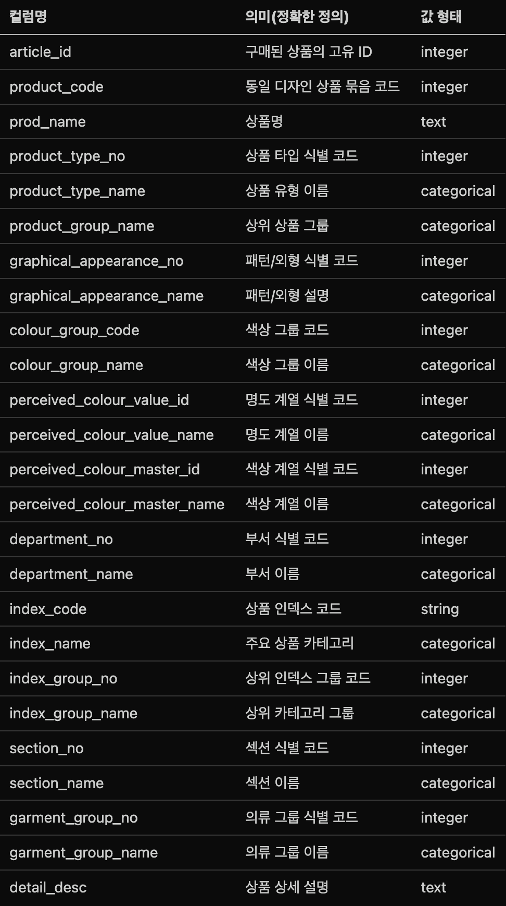
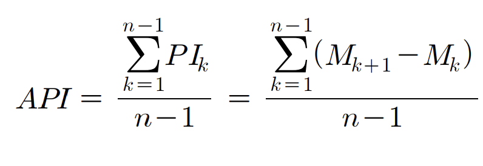
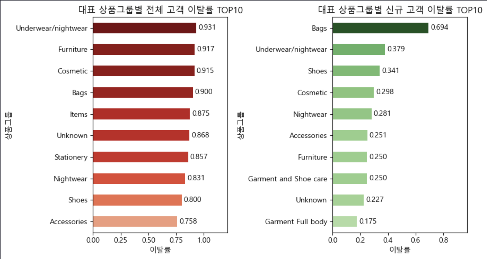
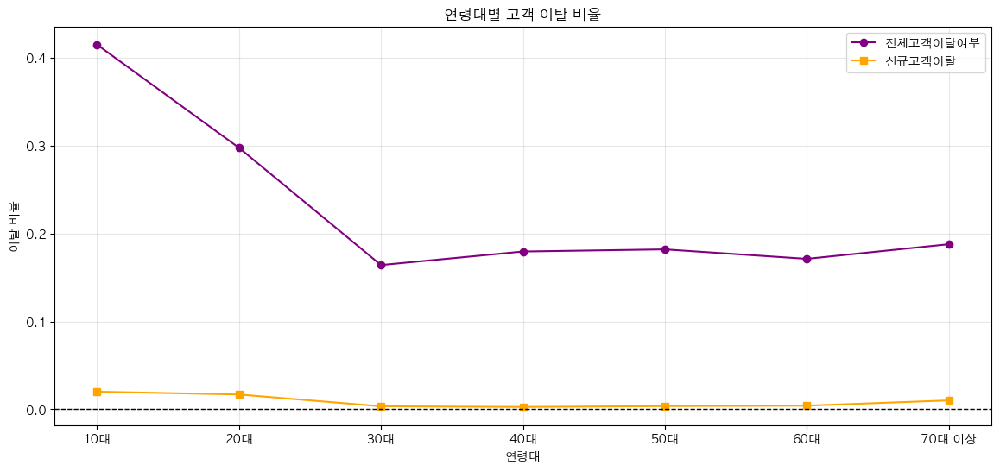
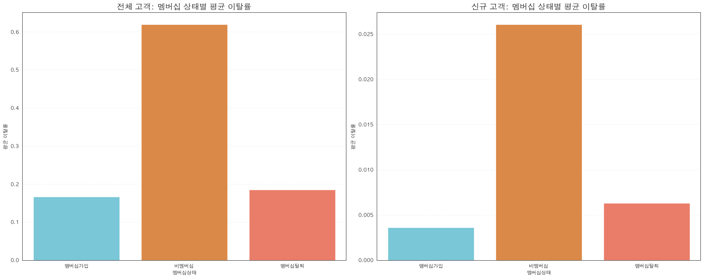

# 🔖2nd_PROJECT_4TEAM

# **프로젝트 명 : 패션 산업 고객 이탈 예측 모델 개발** 📚

## 💡**팀 스티치(Stitch)**
*“고객과 브랜드를 다시 잇는 데이터 한 땀.”*

---

## 🌟 팀원 소개

| 이름 | 깃허브 계정 |
| :--- | :--- |
| **조아름** |[areum117](https://github.com/areum117) |
| **정재훈** |[JeaHoon-J](https://github.com/JeaHoon-J) |
| **정석원** |[JeongSW123](https://github.com/JeongSW123) |
| **김민준** |[miin-jun](https://github.com/miin-jun) |
| **정준하** |[junhaj27](https://github.com/junhaj27) |

---

## 1. 프로젝트 개요

### 1.1 프로젝트 주제 선정 배경

  

#### 1. 패션 산업의 구조적 침체와 고객 이탈 가속화

  경기 침체 속에 패션업계엔 먹구름이 드리워졌다. 소비 쿠폰 효과에 일시적으로 소비 심리가 반등했지만, 경기 침체의 원인이 해소되지 않은 만큼 매출 감소세는 이어지고 있습니다. 

  코로나 이후 일시적인 회복에도 불구하고 국내 패션 소비 시장은 2019년 이전 수준을 간신히 회복한 뒤 정체 국면에 머물러 있으며, 소비자는 더 이상 감성적 마케팅보다 **‘지금 나에게 얼마나 유용한가’** 를 따져 지갑을 여는 양상을 보이고 있습니다.

  중저가·초저가 온라인 플랫폼으로의 이동이 가속화되면서 글로벌 SPA 브랜드 H&M 역시 예외가 아닙니다. 한국 1호 매장인 명동점 폐점을 포함해 오프라인 매장 구조조정을 단행했습니다. 이는 단순 매출 감소를 넘어 수익성 악화, 재고 부담 증가, 기존 고객 기반의 이탈 가능성 등 구조적인 문제로 이어지고 있습니다.

 

#### 2. 데이터 기반 고객 이탈 예측의 필요성

  시장을 잘 안다는 것은 시장을 구성하고 있는 핵심 데이터를 잘 알고 잘 이해하고 있다는 것입니다. 
  좋은 전략, 경쟁력 있는 전략은 직관이나 경험에 의존하기보다, 객관적이고 치밀한 핵심 요소의 데이터 분석과 확률 높은 예측을 전제로 합니다.
  
  그러나, 현재 국내 패션 산업은 디지털 기술 및 데이터 활용 능력이 낮아, 글로벌 주요 브랜드에 비해 CRM(고객 관계 관리) 시스템의 정교함, 고객 데이터 분석 체계, 데이터 기반 의사결정 구조가 부족하다는 지적이 이어지고 있습니다.

  이러한 상황에서 고객 데이터를 실시간으로 통합 및 분석을 하지 못할 경우, 빠르게 변화하는 소비 트렌드와 경쟁 환경에 능동적으로 대응하기 어렵습니다.
  특히 고객 이탈을 사전에 예측하지 못하면, 마케팅 비용 증가와 수익성 악화로 이어질 가능성이 큽니다.

  따라서 데이터 기반 고객 이탈 예측은 선택이 아닌, 지속 가능한 성장을 위한 필수 전략 요소입니다.

---

### 1.2 프로젝트 주제 필요성

- 따라서 본 프로젝트는
    - 패션 산업 환경에서 발생하는 고객 이탈 정의
    - 고객 구매 데이터를 기반으로 이탈 분류 
    - 이탈 예측 모델을 통해 선제적 CRM 전략 수립 가능성 탐색
  
  이를 목적으로 하여 단순히 이탈 여부를 예측하는 데 그치지 않고, 이탈 고객의 패턴과 원인을 설명하는 데 초점을 둡니다.
  
  그리고 이를 통해 신규 고객과 기존 고객의 이탈 원인을 구조적으로 이해하고, 궁극적으로 패션 산업의 데이터 기반 성장 전략 수립에 기여하고자 합니다.

---

## 2.  **기술 스택** 🛠️

| **분류**| **기술/도구** |
|---|---|
| **언어** |      |
| **라이브러리** |         
| **협업 툴** |    |

---

## 3. WBS 📋

### 요구사항 명세서

---

## 4. 데이터 선택 및 특징 🗃️

### 4.1 데이터 선택

- **H&M Personalized Fashion Recommendations**
    - 2018년 9월부터 2020년 9월까지 H&M 기업 온라인& 오프라인 매장 데이터
    - column : 35개
    - row : 약 3100만 개

<**출처**>
https://www.kaggle.com/competitions/h-and-m-personalized-fashion-recommendations/data

---

### 4.2 이탈 정의

### 4.2.1 계약 고객과 비계약 고객
- **계약 고객** : 서비스 이용을 위해 명시적 계약을 체결한 고객
- **비계약 고객** : 상품을 구매하기로 결정하면, 계약의 필요성 없이 최소한의 등록만으로 거래를 하는 고객

    | 구분       | 계약 설정     | 비계약 설정          |
    | -------- | --------- | --------------- |
    | 계약 존재 여부 | 있음        | 없음              |
    | 이탈 기준    | 계약 해지     | 일정 기간 비활성       |
    | 정의 난이도   | 비교적 명확    | 도메인별 정의 필요      |
    | 주요 변수    | 해지일, 약정기간 | 마지막 활동일, 재구매 주기 |
    | 적용 산업 예시|통신, 은행, 보험 등| 이커머스, 온라인 게임 등

---

## 5. 데이터 전처리 및 EDA

### 5.1 데이터 병합 (Data Integration)

- `articles.csv`

    

 

- `customers.csv`

    | 컬럼명                          | 의미(정확한 정의)            | 값 형태         |
    | ----------------------------  | --------------------- | ------------ |
    | customer_id                     | 고객 고유 식별자             | string       |
    | FN                              | 패션 뉴스/마케팅 메시지 수신 여부   | 1 / NaN      |
    | Active                          | 온라인 계정 및 커뮤니케이션 활성 상태 | 1 / NaN      |
    | club_member_status              | H&M 멤버십 상태            | categorical  |
    | fashion_news_frequency          | 뉴스레터 수신 빈도            | categorical  |
    | age                             | 고객 나이                 | numeric      |
    | age_cut                         | 나이를 구간화한 범주           | categorical  |
    | postal_code                     | 익명화된 지역 식별 코드(해시)     | string(hash) |

 

- `transactions_train.csv`

    | 컬럼명                          | 구분     | 의미(정확한 정의)            | 값 형태         |
    | ---------------------------- | ------ | --------------------- | ------------ |
    | customer_id                     | 고객 고유 식별자             | string       |
    | t_dat                           | 구매 발생 날짜              | date         |
    | article_id                      | 구매된 상품의 고유 ID         | integer      |
    | price                           | 구매 가격                 | float        |
    | sales_channel_id                | 구매 채널 구분              | integer      |

 

#### **병합 데이터**

| 단계 | 대상 데이터 | 조인 키 | 방법 | 목적 |
| --- | --- | --- | --- | --- |
| **1차 병합** | `customers` + `transactions` | `customer_id` | Inner Join | 고객별 구매 이력 결합 |
| **2차 병합** | `병합본` + `articles` | `article_id` | Inner Join | 구매한 상품 정보 결합 |

### 5.2 결측치 처리 및 데이터 정제

| 컬럼명 | 처리 방법 | 상세 내용 |
| --- | --- | --- |
| **FN** | `fillna(0)` | 패션 뉴스레터 수신 여부 미기입 시 '수신 안 함' 처리 |
| **Active** | `fillna(0)` | 온라인 마케팅 활성화 여부 미기입 시 '비활성' 처리 |
| **club_member_status** | `dropna` | 'nan' 문자열 변환 후 결측치(0.21%) 제거 |
| **fashion_news_frequency** | `fillna('UNKNOWN')` | 뉴스레터 수신 빈도 정보 없음 고객 분류 |
| **age** | `pd.cut` | 10대~60대 이상 구간화, 결측치는 `UNKNOWN` 처리 |

### 🔹주요 변수
1) **이탈 파생 변수**
- 고객별 **상대적 구매 주기**를 고려한 **API(Average Purchase Interval)** 방식을 채택

    - `API(AveragePurchasing Interval)` : 개인 고객별 구매주기의 평균
    - `LPL(LastPurchasing Lapse)` : 최종구매경과 

    - 
    - $$LPL = \text{Dataset Max Date} - \text{Customer's Last Purchase Date}$$
    - $$Churn =\begin{cases}1 & \text{if } API < LPL \\0 & \text{otherwise}\end{cases}$$

    | 지표명 | 산출 로직 | 분석적 의미 |
    | --- | --- | --- |
    | **API ratio** | `gap 합계` / (`거래일수` - 1) | 고객별 **평균 구매 주기** (구매 간격의 평균) |
    | **LPL** | `last_date` - `최종 구매 시점` | 고객별 최종 구매 시점부터 데이터의 마지막 날짜까지 경과한 기간|
    | **이탈여부(churn)** | `API ratio < LPL` | LPL 값이 API 값보다 큰 경우 이탈로 정의 |
    | **신규고객이탈** | `구매 횟수 == 1` | 첫 구매 이후 추가 구매가 없는 일회성 고객 |
    | **전체고객이탈여부** | `churn + only_first_tran` | 주기적 이탈자와 일회성 고객을 통합한 최종 라벨 |

---

### 5.3 피처 엔지니어링 (Feature Engineering)

### 5.4 최종 데이터 구조 
전처리가 완료된 데이터는 분석 목적에 따라 두 가지 파일로 저장

1.  **`total_churn.csv`**: 전체 고객을 대상으로 한 이탈 예측용 데이터
2.  **`new_churn.csv`**: 신규 가입 고객의 초기 이탈 방지를 위한 예측용 데이터

## 📊 EDA

### 1. 이탈률 분포

- 공통으로 높으면 -> 신규든 기존이든 이탈률이 많이 나오는 상품
- 시간이 지나면서 재구매로 이어지지 못해 이탈이 됐을 가능성을 보여줌
- bag는 신규 고객에서 이탈이 가장 많이 생겼지만 전체 고객으로 봤을 때 이탈순위에서 상대적으로 떨어짐

 

- 10~20대 이탈률이 상대적으로 많이 높음

 

- 비멤버십 고객 이탈률이 매우 높음
- 고객을 멤버십으로 전환시키는 전략이 필요할 것으로 보임

### 2. 상관관계 분석

---

---

## 6. 머신러닝 파이프라인 🔧

### 6.4 모델

#### 6.4.1 Model

#### 7.1.1 성능 비교
## 🤖 모델 선정 결과 (Model Selection)

이탈 예측의 정확도와 실무 활용도를 고려하여 **신규 고객**과 **전체 고객** 모델 모두 **LightGBM**을 최종 모델로 선정하였습니다.

### 1️⃣ 신규 고객 이탈 예측 모델: LightGBM 선정
신규 고객군에서는 LightGBM이 타 알고리즘 대비 가장 압도적인 변별력을 보여주었습니다.

* **성능 지표**:
    * **ROC-AUC**: `0.74` (전체 모델 중 최상위 예측 변별력)
    * **재현율(Recall)**: **`0.69`** (실제 이탈자를 찾아내는 능력 탁월)
* **선정 이유**: 신규 고객은 이탈 징후를 빠르게 포착하는 것이 생존율에 직결됩니다. 본 모델은 높은 재현율을 바탕으로 **이탈 징후를 선제적으로 파악**하여 즉각적인 마케팅 액션을 취하기에 가장 적합한 모델로 판단되었습니다.

---

### 2️⃣ 전체 고객 이탈 예측 모델: LightGBM 선정
데이터의 복잡도가 높은 전체 고객군에서도 LightGBM이 가장 안정적인 예측 성능을 유지했습니다.

* **성능 지표**:
    * **F1-Score**: `0.47` (정밀도와 재현율의 최적 균형)
    * **재현율(Recall)**: `0.45`
* **선정 이유**: 전체 고객 데이터는 변수가 많아 모든 모델이 예측에 어려움을 겪었으나, LightGBM은 타 모델 대비 **가장 높은 F1-Score와 재현율**을 기록했습니다. 불균형 데이터에서도 상대적으로 일관된 성능을 도출하여 전체 고객 관리용 최종 모델로 선정하였습니다.

---

#### 7.1.2 Faker 예측 결과

### 1. 주요 컬럼 설명

| 컬럼명 | 설명 | 비고 |
| :--- | :--- | :--- |
| **LGBM_판단** | 모델이 내린 최종 예측 결론 | **유지** 또는 **이탈** |
| **이탈확률** | 고객이 서비스를 그만둘 확률 (Softmax/Sigmoid 값) | 0.0 ~ 1.0 (0% ~ 100%) |

---

### 2. 상세 해석 기준

#### 🟢 유지 (Stay)
* **정의**: 고객이 서비스를 계속 이용할 것으로 예측됨.
* **기준**: `이탈확률`이 **0.5(50%) 미만**인 경우.
* **예시**: 정준하(index 4) 님은 이탈확률이 **0.109(약 11%)**로 매우 낮아 '유지'로 판단되었습니다.

#### 🔴 이탈 (Churn)
* **정의**: 고객이 서비스를 그만둘 가능성이 높다고 예측됨.
* **기준**: `이탈확률`이 **0.5(50%) 이상**인 경우.
* **예시**: 조아름(index 1) 님은 이탈확률이 **0.777(약 78%)**로 매우 높기 때문에 모델이 '이탈'로 판단하였습니다.

---

### 3. 확률 기반의 의사결정 
> **이탈확률** 수치를 통해 단순히 이탈 여부만 확인하는 것이 아니라, **위험도**에 따른 차별화된 대응이 가능합니다.
> * **초고위험군 (0.8 이상)**: 즉각적인 프로모션이나 혜택 제공 필요.
> * **주의군 (0.5 ~ 0.8)**: 이탈 징후 분석 및 개인화된 마케팅 타겟팅.
> * **안정군 (0.5 미만)**: 지속적인 서비스 만족도 유지 관리.
## 8. 인사이트 🔦

### 8.1 이용자 이탈 방지 전략

## 🎯 피처 기반 대응 전략 (Feature-based Strategies)

모델이 학습한 주요 피처(Feature)의 패턴을 분석하여, 이탈 방지를 위한 구체적인 비즈니스 액션 플랜을 수립합니다.

---

### 💰 1. 가격 (Price)
> **핵심 가치**: 구매 금액과 직접 연결된 행동 지표로, 특히 **고가치(High-Value) 고객**의 이탈을 방지하는 핵심 데이터입니다.

* **중요성**: 고가 상품 구매 후 고객이 이탈하면 브랜드 매출에 큰 손실이 발생합니다. 가격대별 이탈 패턴을 통해 고가 구매 고객의 리텐션 시급성을 판단합니다.
* **모델 학습 패턴**: 모델은 "고가 구매 고객이 이탈(Churn=1)하는 경우"를 반복 학습하여 해당 피처의 중요도(Importance)를 높게 측정합니다.
* **대응 전략**:
    * **리텐션 유도**: 재구매 확률을 높이기 위한 전용 할인 및 타겟 쿠폰 발송.
    * **VIP 케어**: 고가 구매 고객 대상 VIP 전용 혜택을 제공하여 브랜드 충성도 유지.
* **비즈니스 가치**: High-value 고객의 이탈을 사전에 예측하여 매출 타격을 최소화합니다.

---

### 📦 2. 상품그룹 (Product Group)
> **핵심 가치**: 상품 경험 여부는 직접적인 고객 행동과 연관되며, 특정 상품군 경험 부족이 이탈 확률 증가로 이어진다는 통계적 근거를 제공합니다.

* **중요성**: 특정 상품군을 구매한 적 없는 고객은 브랜드 관여도가 낮아 이탈 위험이 큽니다.
* **모델 학습 패턴**: 모델은 "특정 카테고리 경험이 없을 때 Churn=1 확률이 올라가는 패턴"을 학습하여 위험군을 식별합니다.
* **대응 전략**:
    * **관심 기반 추천**: 고객 성향을 분석하여 선호할 가능성이 높은 미경험 상품군을 제안.
    * **카테고리 확장**: 신상품 안내 및 샘플 프로모션을 통해 타 카테고리 제품 경험을 유도.
* **비즈니스 가치**: 고객의 쇼핑 카테고리를 확장시켜 브랜드 고착도(Lock-in)를 높입니다.

---

## 9. 한계점 🧩

- 패션 즉 의류업은 개인적인 관점이 들어가며 브랜드별 혹은 트랜드에 민감하다는 특징이 있어서 해당 부분에 대한 전략이나 해결책 제시는 불가능합니다.
- 각 브랜드의 구체적인 손익에 대한 프로모션은 고려가 불가능합니다.(10% 할인을 해도 몇 퍼센트 이상 판매한다면 이득이다 등)
- 또한 설문·리뷰 등 정성 데이터가 부족해, 정량 분석만으로는 고객의 ‘왜 떠나는지(WHY)’를 완전히 설명하기 어렵다는 한계가 있습니다
- 너무 많은 데이터 양 떄문에 메모리 부족으로 
---

## 10. 수행 결과 페이지 📌

### **팀원 한 줄 회고** 🧑‍💻
 
| **이름** | **회고 내용** |
| :---: |---|
| 조아름 | |
| 정재훈 | |
| 정석원 | |
| 김민준 | | 
| 정준하 | |

## 참고 문헌
#### 기사
- https://biz.newdaily.co.kr/site/data/html/2024/05/08/2024050800361.html
- https://v.daum.net/v/ySVjF0rRCF
- https://www.ktnews.com/news/articleView.html?idxno=136611
- https://m.apparelnews.co.kr/news/news_view/?idx=178576%3Fcat%3DCAT180

#### 논문
- https://uark.pressbooks.pub/ampdglobalsourcing/chapter/10-3-the-importance-of-data-analytics-in-modern-fashion-industry
- [비계약 서비스 산업의 효율적인 이탈예측 모형의 개발](https://dspace.hansung.ac.kr/handle/2024.oak/9834)
<<<<<<< HEAD
- [인공지능 기반 고객 이탈 예측 기술 동향 및 발전방향](http://journal.dcs.or.kr/xml/37355/37355.pdf)

#### 기타
- [데이터 분석가 Seongbin이 말하는 RFM 정의](https://www.fanruan.com/ko-kr/blog/rfm)
- [스토어 성장 전략 전문 미디어 및 팟캐스트](https://ecommercefastlane.com/ko/what-is-customer-churn-3-effective-strategies-to-reduce-it)
=======
- [인공지능 기반 고객 이탈 예측 기술 동향 및 발전방향](http://journal.dcs.or.kr/xml/37355/37355.pdf)
>>>>>>> a59e725 (docs: update readme.md)
